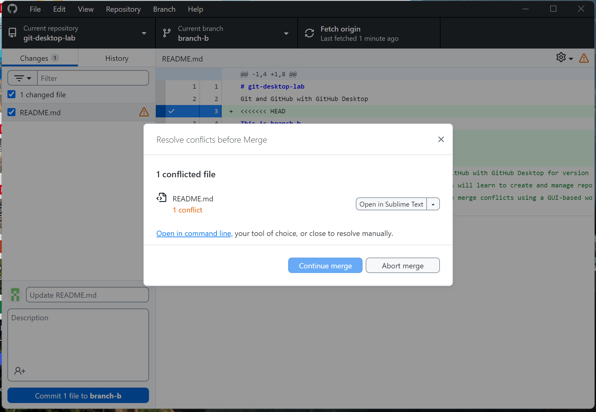
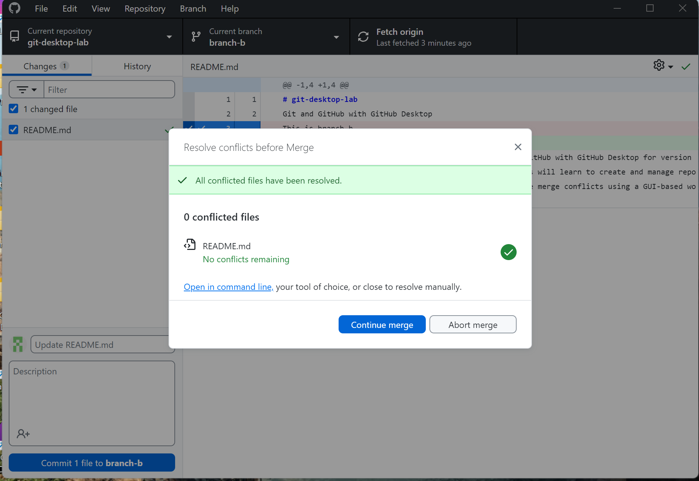

# git-desktop-lab
Git and GitHub with GitHub Desktop
This is branch A
This lab is to gain practical experience using Git and GitHub with GitHub Desktop for version control, collaboration, and conflict resolution. Students will learn to create and manage repositories, commit changes, work with branches, and resolve merge conflicts using a GUI-based workflow.

##Lab Summary

## Repository Setup
- Repository created on GitHub with the name `git-desktop-lab`.
- Initialized with a README file.
- Cloned to the local machine using GitHub Desktop.

## Basic Git Operations
- Created `info.txt` containing name, student ID, and course.
- Edited `README.md` to describe the lab’s purpose.
- Committed each file separately with the following messages:
  - `Add info.txt with personal details`
  - `Update README.md with lab description`
- Pushed changes to GitHub.

## Branching and Merging
- Created a new branch `feature/new-content`.
- In this branch, added `content.txt` with a paragraph about a favorite topic.
- Committed with message: `Add content.txt with favorite topic`
- Pushed branch to GitHub.
- Opened a pull request and merged `feature/new-content` into `main`.
- Pulled the latest changes to the local `main` branch.

## Merge Conflict Resolution
- Created two new branches: `branch-a` and `branch-b`.
- In `branch-a`, edited a line in `README.md` to include: "This is branch A"
- In `branch-b`, edited the same line to include: "This is branch B"
- Merged `branch-a` into `main`.
- Switched to `branch-b` and pulled from `main`, triggering a merge conflict.
- Manually resolved the conflict by editing the file to say: This is branch b and A
- Removed all conflict markers and saved the file.
- Marked the conflict as resolved, committed, and pushed `branch-b`.
- Merged `branch-b` into `main` via pull request.

## Documentation and Reflection
- Practiced repository setup, committing, branching, merging, and conflict resolution.
- Learned how to use GitHub Desktop to manage Git workflows.
- Understood how to resolve a merge conflict manually by editing conflict markers.
- Used clear and descriptive commit messages throughout the lab.

## Screenshot: Merge Conflict Resolution

